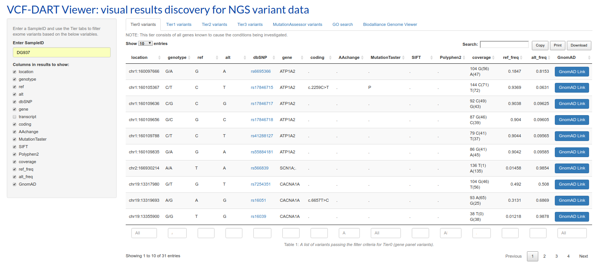

# VCF-DART Viewer (VCF file Diagnostics Annotation and Reporting Tool Viewer)

A Shiny interface to filter and identify variants of interest from NGS variant data in VCF file format.

**Published article:**
> Benton MC, Smith RA, Haupt LM, Sutherland HG, Dunn PJ, Albury CL, Maksemous N, Lea RA, and Griffiths LR. (2019) _Variant Call Format (VCF)-Diagnostic Annotation and Reporting Tool (VCF-DART) A Customizable Analysis Pipeline for Identification of Clinically Relevant Genetic Variants in Next-Generation Sequencing Data_. The Journal of Molecular Diagnostics [(article)](https://jmd.amjpathol.org/article/S1525-1578(19)30353-8/fulltext)

-----

## IMPORTANT - Please Read

This repository contains the most stable version of VCF-DART that accompanies the published article. For more recent stable and development builds and to contribute please visit the [Genomics Aotearoa](https://github.com/GenomicsAotearoa) GitHub.

**Disclaimer**

Please note that this is a beta version of the VCF-DART platform which is
still undergoing final testing before its official release. The
platform, its software and all content found on it are provided on an
“as is” and “as available” basis. VCF-DART does not give any warranties,
whether express or implied, as to the suitability or usability of the
website, server, its software or any of its content.

VCF-DART will not be liable for any loss, whether such loss is direct,
indirect, special or consequential, suffered by any party as a result
of their use of the VCF-DART platform, its software or content. Any
downloading or uploading of material to the website/server is done at the
user’s own risk and the user will be solely responsible for any
damage to any computer system or loss of data that results from such
activities.

Should you encounter any bugs, glitches, lack of functionality or
other problems on the website, please let us know immediately so we
can rectify these accordingly. Your help in this regard is greatly
appreciated! The best way to do this is to log an issue in this GitHub repository, 
or if you feel inclined you are welcome to create a pull request.

-----

The tool uses custom gene lists to categorise variants into specific analysis tiers and to subcategorise them based on standard parameters to facilitate the rapid interrogation of potentially pathogenic variants by human operators. For more information see our [manuscript](https://www.authorea.com/users/21564/articles/298265-a-customisable-scripting-system-for-identification-and-filtration-of-clinically-relevant-genetic-variants-in-whole-exome-or-large-gene-panel-data#).



Alongside the different tiers (first 4 tabs) there are 3 additional tabs:

  - **Mutation Assessor and Mutation Taster damaging:** A list of variants predicted as being potentially most damaging (Mutation Assessor High risk), including URL to variant information.
  - **Gene Ontology (GO) searching for a given gene/list of genes:** reports GO terms and links out to GO, UniProt and PubMed evidence (where present).
  - **Integrated Biodalliance Genome Viewer:** a reactive real-time genome track viewer capable of rendering bam and vcf files, as well as many other genomic tracks (including custom).

## Configure the `home` directory

This is the directory that contains all the results files (from [VCF-DART](https://github.com/sirselim/diagnostics_exome_reporting)) to be viewed. This must be set before running the VCF-Dart Viewer server.

The user is required to edit the appropriate line in the `global.R` file:

```R
# set directory to search for results files
HOMEDIR <- "/home/grcnata/"
addResourcePath("homeDir", HOMEDIR)
res.list <- list.files(HOMEDIR, recursive = T, pattern = '.csv', full.names = T)
MutAssess.links <- list.files(HOMEDIR, recursive = T, pattern = '_MutationAssessor_links_', full.names = T)
```

## Software Dependencies

The following programs need to be available/installed for correct operation:

  - [R](https://www.r-project.org/)
  - [Shiny Server](https://www.rstudio.com/products/shiny/shiny-server/)

## R Package Dependencies

VCF-DART Viewer requires the following packages (and their dependencies) to be installed for correct operation:

```R
# CRAN
install.packages('shiny')
install.packages('DT')
install.packages('magrittr')
# bioconductor
source("https://bioconductor.org/biocLite.R")
biocLite('GO.db')
```

## To-do list / feature list

  - [ ] change repository name to reflect the new naming scheme (VCF-DART Viewer)
  - [x] ~~added a help / getting started tab~~
  - [x] ~~add ability to download the precompiled report generated in the VCF-DART module~~
    + [x] ~~either a new tab or a button in the sidebar~~
    + [x] ~~also added ability to download log files~~
    + [x] ~~added ability to download an archieve (.tar.gz) of al run data~~
  - [x] ~~fix bug that means server has to be restarted to identify recent results~~
    + [x] ~~added some functions using reactivePoll to monitor the updating and creation of files~~
    + [x] ~~test the above fix to ensure it is truely reactive~~
  - [x] ~~add ability to generate html links to NCBI for variants with RS numbers~~
  - [x] ~~add ability to generate html links out to GnomAD for each variant~~
  - [x] ~~investigate why the biomartr go function is taking so long~~
    + [x] ~~new method implemented, local database created and loaded in `global_load_data.RData`~~
    + [x] ~~include linking out to GO, UniProt and NCBI from this table~~
    + [x] ~~replace biomartr with GO.db - massive speed increase~~
    + [x] ~~add ontology information to GO table~~
  - [ ] strange issue with newer VEP, adds '%3D' to syn amino acid coding annotation, i.e. p.Pro1620%3D
    + [x] ~~added a quick fix to `server.R` to replace these values with `.`~~
    + [ ] investigate this further, might require an issue on VEP GitHub
  - [x] ~~investigate a bug where the file names don't reflect the correct sample when downloaded via the DT buttons~~
    + [x] ~~DT buttons aren't reactive, have removed sampleID from filename, user can define when downloading~~
  - [x] ~~fix issue with timestamp in filename when downloading data~~
  - [x] ~~record the package dependencies~~

  ## License

    Copyright (C) 2018  Miles Benton

    This program is free software: you can redistribute it and/or modify
    it under the terms of the GNU General Public License as published by
    the Free Software Foundation, either version 3 of the License, or
    (at your option) any later version.

    This program is distributed in the hope that it will be useful,
    but WITHOUT ANY WARRANTY; without even the implied warranty of
    MERCHANTABILITY or FITNESS FOR A PARTICULAR PURPOSE.  See the
    GNU General Public License for more details.

    You should have received a copy of the GNU General Public License
    along with this program.  If not, see <http://www.gnu.org/licenses/>.